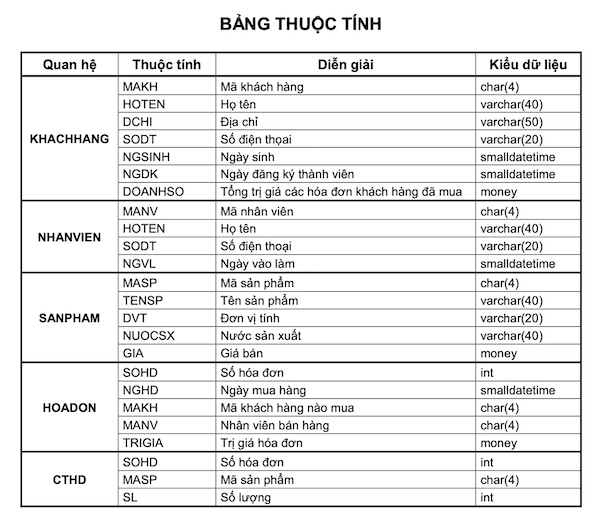
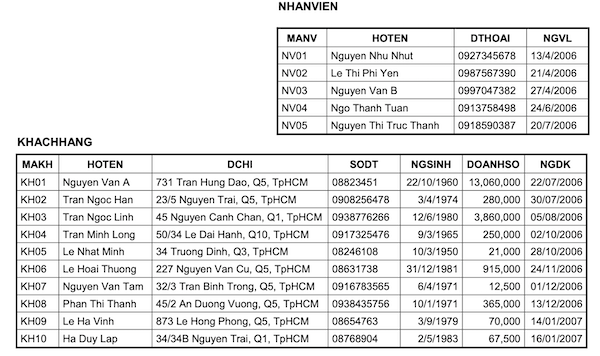
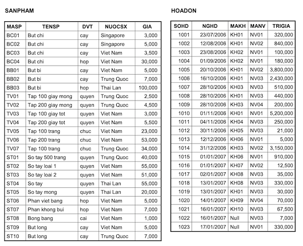
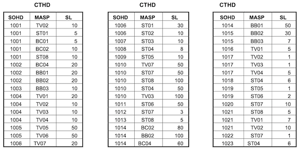

#### Bài 1
1. Tạo bảng "customers", gồm các trường id, name, email và phone.
2. Thêm 5 khách hàng mới vào bảng "customers".
3. Sửa thông tin của một khách hàng có id là 1.
4. Xoá một khách hàng có id là 5.
5. Lấy tất cả các khách hàng có email là "example@gmail.com".
6. Tạo bảng "orders", gồm các trường id, customer_id, total_amount và order_date. (Thêm ràng buộc cho khoá ngoại delete cascade)
7. Thêm một đơn hàng mới vào bảng "orders" cho khách hàng có id là 3.
8. Lấy tất cả các đơn hàng của khách hàng có id là 3.
9. Lấy danh sách khách hàng và đơn hàng của họ, sử dụng câu lệnh JOIN.
10. Lấy danh sách email của khách hàng, sử dụng hàm DISTINCT.

 

#### Bài 2
1. Tạo bảng theo yêu cầu sau
  - `KHACHHANG (MAKH, HOTEN, DCHI, SODT, NGSINH, DOANHSO, NGDK)`
  - Quan hệ khách hàng sẽ lưu trữ thông tin của khách hàng thành viên gồm có các thuộc tính: mã khách hàng, họ tên, địa chỉ, số điện thoại, ngày sinh, ngày đăng ký và doanh số (tổng trị giá các hóa đơn của khách hàng thành viên này).

  - `NHANVIEN (MANV,HOTEN, NGVL, SODT)`
  - Mỗi nhân viên bán hàng cần ghi nhận họ tên, ngày vào làm, điện thọai liên lạc, mỗi nhân viên phân biệt với nhau bằng mã nhân viên.

  - `SANPHAM (MASP,TENSP, DVT, NUOCSX, GIA)`
  - Mỗi sản phẩm có một mã số, một tên gọi, đơn vị tính, nước sản xuất và một giá bán.

  - `HOADON (SOHD, NGHD, MAKH, MANV, TRIGIA)`
  - Khi mua hàng, mỗi khách hàng sẽ nhận một hóa đơn tính tiền, trong đó sẽ có số hóa đơn, ngày mua, nhân viên nào bán hàng, trị giá của hóa đơn là bao nhiêu và mã số của khách hàng nếu là khách hàng thành viên.

  - `CTHD (SOHD,MASP,SL)`
  - Diễn giải chi tiết trong mỗi hóa đơn gồm có những sản phẩm gì với số lượng là bao nhiêu.
  - Sơ đồ thể hiện mối quan hệ giữa các bảng
  
 

 

2. Tạo câu lệnh Insert, update và xoá dữ liệu
  - Tạo câu lệnh truy vấn insert các dữ liệu sau
   
  
  
  
  
  
   
  
  1. Tạo các quan hệ và khai báo các khóa chính, khóa ngoại của quan hệ.
  2. Thêm vào thuộc tính GHICHU có kiểu dữ liệu varchar(20) cho quan hệ SANPHAM.
  3. Thêm vào thuộc tính LOAIKH có kiểu dữ liệu là tinyint cho quan hệ KHACHHANG.
  4. Cập nhật tên “Nguyễn Văn B” cho dữ liệu Khách Hàng có mã là KH01
  5. Cập nhật tên “Nguyễn Văn Hoan” cho dữ liệu Khách Hàng có mã là KH09 và năm đăng ký là 2007
  6. Sửa kiểu dữ liệu của thuộc tính GHICHU trong quan hệ SANPHAM thành varchar(100).
  7. Xóa thuộc tính GHICHU trong quan hệ SANPHAM.
  8. Xoá tất cả dữ liệu khách hàng có năm sinh 1971
  9. Xoá tất cả dữ liệu khách hàng có năm sinh 1971 và năm đăng ký 2006
  10. Xoá tất hoá đơn có mã KH = KH01
